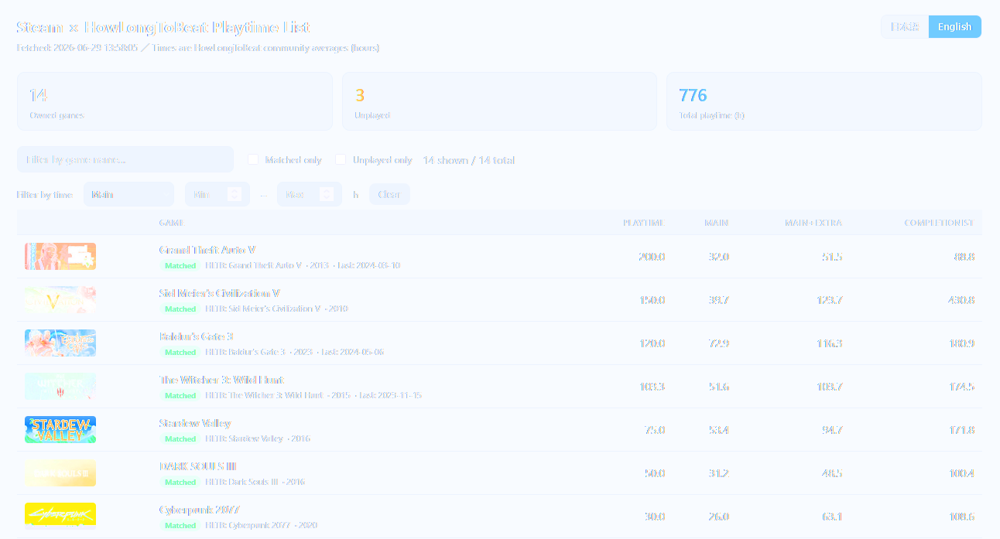

[English](README.md) | **日本語**

# steam-hltb

自分が所有する Steam ライブラリのゲームを [HowLongToBeat](https://howlongtobeat.com)（HLTB）の
データと照合し、各ゲームの平均クリア時間（メイン / メイン+サブ / 完全クリア）と
自分の実プレイ時間を **HTML の一覧表** にまとめるツールです。

- 1つのファイルだけで動作。ダウンロードしてダブルクリックするだけ。インストール不要。
- 結果はソート・絞り込みができる自己完結型の HTML ページ。
- HLTB 照合結果はローカルにキャッシュされ、再実行が高速です。

<p></p>

## ダウンロード

お使いの OS 用のファイルを [**Releases**](../../releases) ページから入手してください
（セットアップ不要です）:

- **Windows:** `steam-hltb.exe`
- **macOS / Linux:** `steam-hltb`

> Windows では、初回起動時に青い「Windows によって PC が保護されました」
> （SmartScreen）が出ることがあります。無料・未署名のツールではよくあることなので、
> **「詳細情報」→「実行」** で起動できます。

## 必要なもの

1. **Steam Web API キー** … 無料。下記で取得します。
2. **SteamID64**（17 桁の数値 ID）

> **メモ:** このツールを**使うだけなら Go のインストールやビルドコマンドは不要**です。
> [ダウンロード](#ダウンロード)からファイルを入手するだけで使えます。Go が必要なのは、
> 自分でソースからビルドしたい場合だけです（末尾の
> [ソースからビルドする](#ソースからビルドする任意)を参照）。

### Steam Web API キーの取得

1. https://steamcommunity.com/dev/apikey にアクセス（Steam ログインが必要）
2. ドメイン名は何でも可（例: `localhost`）を入力して登録
3. 表示される 32 文字のキーを控える

> キーは「あなた自身のアカウント」のものです。本人のライブラリであれば、
> プロフィールが非公開でもこのキーで取得できます。

### SteamID64 の調べ方

- プロフィール URL が `https://steamcommunity.com/profiles/7656119XXXXXXXXXX/` なら、その数字が SteamID64 です。
- カスタム URL（`/id/yourname`）の場合は、[steamid.io](https://steamid.io) などに URL を貼ると `steamID64` が分かります。

## キーと ID の設定（`.env` ファイル）

いちばん簡単なのは、`.env` という名前の小さなテキストファイルを
**プログラムと同じフォルダ**に置き、キーと ID を書いておく方法です:

```ini
STEAM_API_KEY=あなたの32文字のキー
STEAM_ID=7656119XXXXXXXXXX
```

同梱の `.env.example` を `.env` にコピーして、値を埋めるだけでもOKです。

> `.env` は git の管理対象外（公開されません）。API キーはパスワード級の秘密情報なので、
> 絶対に他人に渡さないでください。

（上級者向け: コマンドラインで `-key` / `-steamid` を渡したり、環境変数
`STEAM_API_KEY` / `STEAM_ID` を設定することもできます。優先順位は
コマンド引数 > 環境変数 > `.env` です。）

## 使い方（2 つのモード）

### A. レポートを一回だけ生成（かんたんな方法）★おすすめ

**コマンド入力は不要です:**

1. キーと SteamID を書いた `.env` ファイルを、`steam-hltb.exe` と
   **同じフォルダ**に置きます。
2. エクスプローラーで **`steam-hltb.exe` をダブルクリック**します。
3. ウィンドウが開いて進捗が表示されます。完了すると同じフォルダに
   `report.html` が作られ、**自動でブラウザで開きます**。

これだけです。入力するコマンドはありません。
（ダブルクリックではオプションを渡せないため、`.env` ファイルでキーと SteamID を読み取ります。）

初回はライブラリ全件を HLTB に問い合わせるため、本数に応じて数十秒〜数分かかります
（負荷軽減のためリクエスト間隔を空けています）。2 回目以降はキャッシュにより高速です。
このレポートは生成時点のスナップショットで、ページをリロードしても内容は更新されません。

<details>
<summary>コマンドラインから実行する場合（任意）</summary>

```bash
./steam-hltb            # .env があれば引数不要
open report.html        # 自動で開かなかった場合のみ
```

`-open=false` を付けると、ブラウザの自動オープンを無効化できます。
</details>

### B. サーバーモード（リロードで最新化）★

```bash
./steam-hltb -serve
# ✔ サーバー起動: http://localhost:8765/
```

ブラウザが自動で開きます。**リロードするたびに Steam のプレイ時間を再取得**し、
最新の表を表示します（HLTB の平均時間はキャッシュ利用なので高速）。API キーは
プログラム側に保持され、HTML には出ません。ページ上部の「🔄 最新に更新」ボタンでも更新できます。

一定間隔で自動更新したい場合:

```bash
./steam-hltb -serve -refresh 60s     # 60 秒ごとに自動リロード
```

> プレイ時間は Steam 側の集計が反映されるタイミングで更新されます
> （プレイ中ではなく、ゲーム終了後しばらくして反映されることが多いです）。

## オプション

以下はコマンドラインから実行するときに使えます（ダブルクリック時は既定値が使われます）。

| フラグ | 既定値 | 説明 |
|---|---|---|
| `-key` | env `STEAM_API_KEY` / `.env` | Steam Web API キー |
| `-steamid` | env `STEAM_ID` / `.env` | SteamID64（17 桁） |
| `-serve` | `false` | ローカルサーバーを起動し、リロードで最新化する |
| `-addr` | `localhost:8765` | サーバーモードの待受アドレス |
| `-refresh` | `0` | サーバーモードの自動更新間隔（例 `60s`。0=なし） |
| `-out` | `report.html` | 出力する HTML ファイル（ファイルモード） |
| `-open` | `true` | 完了後にレポート／サーバー URL をブラウザで自動的に開く |
| `-cache` | `hltb_cache.json` | HLTB 照合結果のキャッシュ |
| `-no-cache` | `false` | キャッシュを使わず毎回問い合わせる |
| `-concurrency` | `4` | HLTB への同時リクエスト数 |
| `-min-similarity` | `0.5` | 一致とみなす類似度のしきい値（0〜1） |
| `-delay` | `300ms` | HLTB リクエスト間の最小間隔 |
| `-limit` | `0` | 処理本数の上限（0=全件。動作確認用） |

例: まず 20 本だけで試す

```bash
./steam-hltb -limit 20
```

## 出力される HTML について

- 上部の **サマリーカード**: 所有本数 / 未プレイ本数 / 合計プレイ時間。
- **テーブル**: 列ヘッダをクリックでソート、上部の入力欄で名前フィルタ、
  「照合成功のみ」「未プレイのみ」のチェックで絞り込み。
- **プレイ時間フィルタ**: メイン / メイン＋サブ / 完全クリア を選び、
  下限・上限（時間）を入力すると、その範囲のゲームだけに絞り込めます
  （HLTB の時間データが無い行は範囲指定時に非表示になります）。
- **言語切替**: 右上の「日本語 / English」ボタンで UI 表記を切り替えられます
  （選択はブラウザに保存され、次回も維持されます）。
- 各行の **バッジ**:
  - `一致` … 類似度がしきい値以上（信頼できる）
  - `要確認` … 候補は見つかったが類似度が低い（別タイトルの可能性）
  - `未一致` … HLTB に候補が見つからなかった

## ソースからビルドする（任意）

ダウンロード版（[Releases](#ダウンロード)）を使わず、自分でビルドしたい場合のみ必要です。
**Go 1.21 以上**が必要です。

```bash
cd steam-hltb
go build -o steam-hltb .
```

### テスト

```bash
go test -short          # オフラインの単体テスト（正規化・類似度）
go test                 # HLTB へのライブ検索を含む全テスト
```

## 注意・既知の制約

- HLTB は**公式 API を公開していません**。本ツールはサイトのフロントエンドが使う
  内部エンドポイント（`/api/bleed`）を利用しています。HLTB 側の仕様変更で
  動かなくなる可能性があり、その場合は `hltb.go` の修正が必要です。
- ゲーム名のあいまい一致のため、まれに誤った作品を拾うことがあります
  （`要確認` バッジで確認してください）。`-min-similarity` で厳しさを調整できます。
- 元の名前でしきい値以上の一致が得られない場合は、`(` 以降や ` - `（サブタイトル区切り）
  以降を削った短いタイトルで自動的に再検索します。エディション表記などで HLTB に
  ヒットしないゲームの取りこぼしを減らせます。
- DLC やサウンドトラック、ベンチマーク等もライブラリに含まれると HLTB に無いことがあります。
- 取得できるのは「所有ゲーム」です。プロフィールのゲーム詳細が非公開の場合でも、
  **API キー所有者本人の SteamID** であれば取得できます。

## 免責・利用上の注意（Disclaimer）

- 本ツールは **非公式** の個人向けユーティリティであり、Valve / Steam、
  および HowLongToBeat とは **一切関係なく、提携・承認もされていません**。
  各社の名称・データは各権利者に帰属します。
- HowLongToBeat は公式 API を公開していないため、サイトのフロントエンドが使う
  内部エンドポイント（`/api/bleed`）を利用しています。これは予告なく変更・停止される
  可能性があります。**個人利用の範囲で、各サービスの利用規約を尊重して**ご利用ください。
- サーバーに過度な負荷をかけないよう、リクエスト間隔（`-delay`）と同時実行数
  （`-concurrency`）を控えめな既定値にしています。大量取得や短間隔での連続実行は
  避けてください。
- Steam Web API キーは **あなた自身のアカウント** の秘密情報です。第三者に渡したり、
  リポジトリ・スクリーンショット等に含めたりしないでください。万一漏れた場合は
  https://steamcommunity.com/dev/apikey で速やかに再発行（失効）してください。
- 本ソフトウェアは「現状有姿（AS IS）」で提供され、無保証です（詳細は LICENSE を参照）。

## ライセンス

[MIT License](LICENSE) で公開しています。
